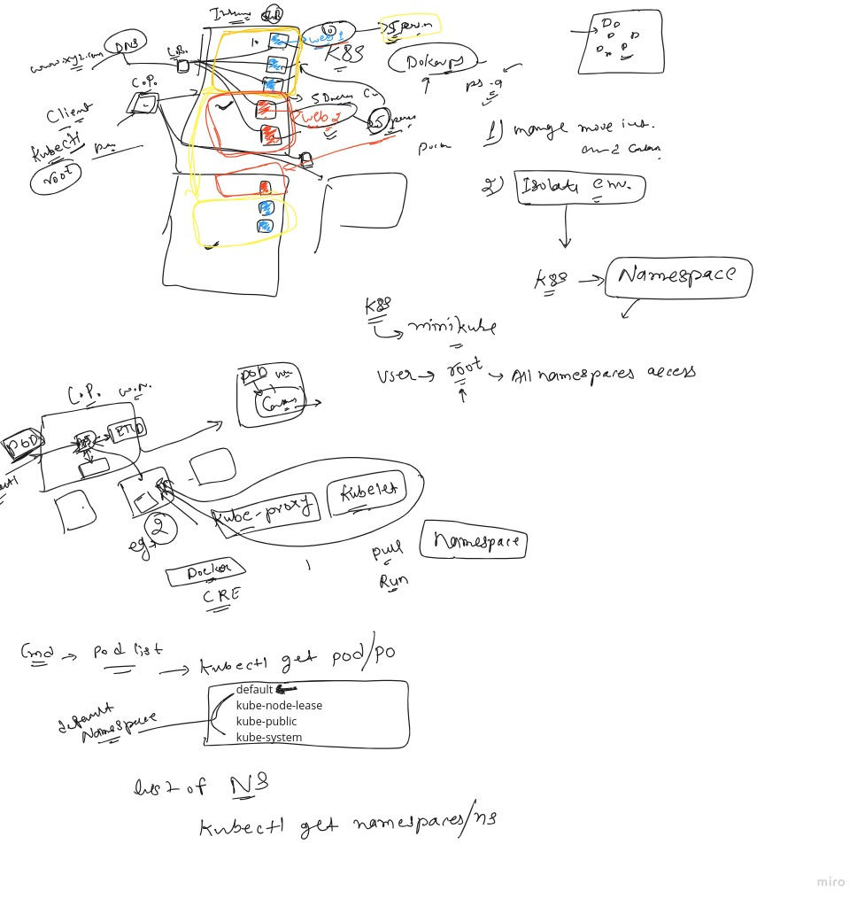
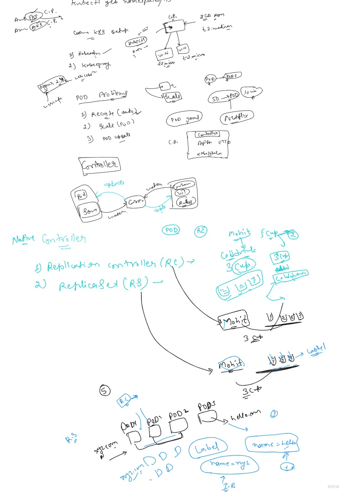

# night_b
### introduction about Namespace


### namespaces
```
akash@sky:~$ kubectl get namespaces 
NAME                   STATUS   AGE
ak                     Active   23d
default                Active   33d
ingress-nginx          Active   33d
kube-node-lease        Active   33d
kube-public            Active   33d
kube-system            Active   33d
kubernetes-dashboard   Active   15d
akash@sky:~$ kubectl get  ns
NAME                   STATUS   AGE
ak                     Active   23d
default                Active   33d
ingress-nginx          Active   33d
kube-node-lease        Active   33d
kube-public            Active   33d
kube-system            Active   33d
kubernetes-dashboard   Active   15d
akash@sky:~$ kubectl get pod
NAME   READY   STATUS    RESTARTS      AGE
ak     1/1     Running   1 (10m ago)   6d23h
akash@sky:~$ kubectl delete po ak
pod "ak" deleted
akash@sky:~$ kubectl get pod
No resources found in default namespace.

akash@sky:~$ docker ps
CONTAINER ID   IMAGE                                 COMMAND                  CREATED      STATUS          PORTS                                                                                                                                  NAMES
f897b04f4708   gcr.io/k8s-minikube/kicbase:v0.0.37   "/usr/local/bin/entr…"   7 days ago   Up 13 minutes   127.0.0.1:49157->22/tcp, 127.0.0.1:49156->2376/tcp, 127.0.0.1:49155->5000/tcp, 127.0.0.1:49154->8443/tcp, 127.0.0.1:49153->32443/tcp   minikube
akash@sky:~$ kubectl get po --namespace kube-system
NAME                                      READY   STATUS    RESTARTS       AGE
calico-kube-controllers-7bdbfc669-m5jwl   1/1     Running   8 (15m ago)    33d
calico-node-wqqmj                         1/1     Running   8 (15m ago)    33d
coredns-787d4945fb-jgq2f                  1/1     Running   8 (15m ago)    33d
etcd-minikube                             1/1     Running   8 (15m ago)    33d
kube-apiserver-minikube                   1/1     Running   9 (15m ago)    33d
kube-controller-manager-minikube          1/1     Running   8 (15m ago)    33d
kube-proxy-bfd9s                          1/1     Running   8 (15m ago)    33d
kube-scheduler-minikube                   1/1     Running   9 (15m ago)    33d
storage-provisioner                       1/1     Running   16 (14m ago)   33d
akash@sky:~$ kubectl get po -A
NAMESPACE              NAME                                        READY   STATUS      RESTARTS       AGE
ingress-nginx          ingress-nginx-admission-create-24v5t        0/1     Completed   0              33d
ingress-nginx          ingress-nginx-admission-patch-f5pvc         0/1     Completed   0              33d
ingress-nginx          ingress-nginx-controller-6cc5ccb977-pbh74   1/1     Running     8 (17m ago)    33d
kube-system            calico-kube-controllers-7bdbfc669-m5jwl     1/1     Running     8 (17m ago)    33d
kube-system            calico-node-wqqmj                           1/1     Running     8 (17m ago)    33d
kube-system            coredns-787d4945fb-jgq2f                    1/1     Running     8 (17m ago)    33d
kube-system            etcd-minikube                               1/1     Running     8 (17m ago)    33d
kube-system            kube-apiserver-minikube                     1/1     Running     9 (17m ago)    33d
kube-system            kube-controller-manager-minikube            1/1     Running     8 (17m ago)    33d
kube-system            kube-proxy-bfd9s                            1/1     Running     8 (17m ago)    33d
kube-system            kube-scheduler-minikube                     1/1     Running     9 (17m ago)    33d
kube-system            storage-provisioner                         1/1     Running     16 (16m ago)   33d
kubernetes-dashboard   dashboard-metrics-scraper-5c6664855-tz9pc   1/1     Running     3 (17m ago)    15d
kubernetes-dashboard   kubernetes-dashboard-55c4cbbc7c-jbtvd       1/1     Running     3 (17m ago)    15d
akash@sky:~$ kubectl create namespace myspace
namespace/myspace created
akash@sky:~$ kubectl get ns
NAME                   STATUS   AGE
ak                     Active   23d
default                Active   33d
ingress-nginx          Active   33d
kube-node-lease        Active   33d
kube-public            Active   33d
kube-system            Active   33d
kubernetes-dashboard   Active   15d
myspace                Active   4s
akash@sky:~$ kubectl config get-contexts
CURRENT   NAME                                                CLUSTER                                             AUTHINFO                                            NAMESPACE

*         minikube                                            minikube                                            minikube                                            default

akash@sky:~$ kubectl config set-context --current --namespace myspace
Context "minikube" modified.
```
# 16aug raplication controller
```
akash@sky:~/night/k8s$ kubectl apply -f rc.yml 
replicationcontroller/ak-rc created
akash@sky:~/night/k8s$ kubectl get po
NAME          READY   STATUS              RESTARTS   AGE
ak-rc-r94jf   0/1     ContainerCreating   0          5s
akash@sky:~/night/k8s$ kubectl get po
NAME          READY   STATUS              RESTARTS   AGE
ak-rc-r94jf   0/1     ContainerCreating   0          11s
akash@sky:~/night/k8s$ kubectl get po
NAME          READY   STATUS              RESTARTS   AGE
ak-rc-r94jf   0/1     ContainerCreating   0          12s
akash@sky:~/night/k8s$ kubectl get po
NAME          READY   STATUS    RESTARTS   AGE
ak-rc-r94jf   1/1     Running   0          13s
akash@sky:~/night/k8s$ kubectl delete po ak-rc-r94jf 
pod "ak-rc-r94jf" deleted
akash@sky:~/night/k8s$ kubectl get po
NAME          READY   STATUS              RESTARTS   AGE
ak-rc-qf8m2   0/1     ContainerCreating   0          4s
akash@sky:~/night/k8s$ kubectl get po
NAME          READY   STATUS    RESTARTS   AGE
ak-rc-qf8m2   1/1     Running   0          6s
akash@sky:~/night/k8s$ kubectl apply -f rc.yml 
replicationcontroller/ak-rc configured
akash@sky:~/night/k8s$ kubectl get po
NAME          READY   STATUS              RESTARTS   AGE
ak-rc-ncqkv   0/1     ContainerCreating   0          3s
ak-rc-qf8m2   1/1     Running             0          37s
ak-rc-qwtdl   0/1     ContainerCreating   0          3s
ak-rc-szjd6   0/1     ContainerCreating   0          3s
ak-rc-vv88t   0/1     ContainerCreating   0          3s
akash@sky:~/night/k8s$ kubectl get po --show-labels
NAME          READY   STATUS    RESTARTS   AGE   LABELS
ak-rc-ncqkv   1/1     Running   0          23s   web=xyz
ak-rc-qf8m2   1/1     Running   0          57s   web=xyz
ak-rc-qwtdl   1/1     Running   0          23s   web=xyz
ak-rc-szjd6   1/1     Running   0          23s   web=xyz
ak-rc-vv88t   1/1     Running   0          23s   web=xyz
akash@sky:~/night/k8s$ kubectl get rc
NAME    DESIRED   CURRENT   READY   AGE
ak-rc   5         5         1       8s
akash@sky:~/night/k8s$ kubectl get po
NAME          READY   STATUS    RESTARTS   AGE
ak-rc-2r8g4   1/1     Running   0          24s
ak-rc-72hmj   1/1     Running   0          24s
ak-rc-hxxz4   1/1     Running   0          24s
ak-rc-rpmws   1/1     Running   0          24s
ak-rc-t52jp   1/1     Running   0          24s
akash@sky:~/night/k8s$ kubectl delete rc ak-rc
replicationcontroller "ak-rc" deleted
akash@sky:~/night/k8s$ kubectl get pod
No resources found in default namespace.
akash@sky:~/night/k8s$ 
```
### rc

